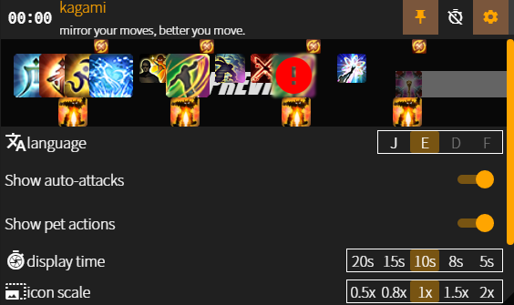

# kagami

*kagami* is **mirror** in Japanese. 

show your FFXIV skill rotations with *kagami*, looking back your rotations with *kagami*!

## example videos👀

- [NIN PoV video.](https://youtu.be/He6r6paOYp4) can check miss positional

- [SMN PoV](https://youtu.be/mkAPPWO0x0A). can check egi/bahamut pet actions👀, and use with other overlay([MOPIMOPI](https://github.com/HAERUHAERU/mopimopi))

## features🚀

- show player & pet actions.
- track player casting and its interrupt.
- melee positional(rear/flank) check
- pet actions validation
- rich settings✨

## installation🔨

See [installation](https://github.com/ramram1048/kagami/blob/master/installation.md).
current *kagami* works with: FFXIV patch `5.25`

## known issues🚧

- cannot indicate pet before *kagami* launch
  (you have to re-summon your pet after launch *kagami*😥)
- item, mount icons are coming out later than expected timing
- bug on pet action validation when hitting low-level striking dummies(see [#8](https://github.com/ramram1048/kagami/issues/8))

## upcoming features⚡

- off positional check or pet actions validation setting
- theme customization

## contact💬

- discord `ram#5923` (japanese, english, korean)
- or make [issue](https://github.com/ramram1048/kagami/issues) in this repository
- any PRs are welcome, especially:
  - DE, FR language
